# Cloud-Native Architecture on AWS: TechWare Application Deployment Guide


This repository contains the infrastructure as code (Terraform) and application code for a secure, scalable cloud-native architecture deployed on AWS for Techware project .

## Architecture Overview

The architecture consists of the following components:

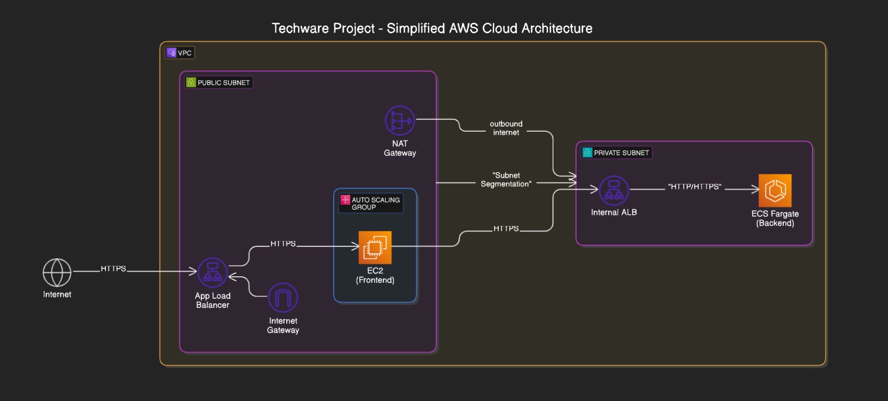

### Network Layer
- VPC with public and private subnets across multiple Availability Zones
- Internet Gateway for public internet access
- NAT Gateway for private subnet internet access
- Security groups with least privilege access control

### Backend Services
- ECS Fargate cluster running containerized microservices
- Backend API deployed as ECS Tasks in private subnets
- Internal Application Load Balancer (not publicly accessible)
- Auto-scaling based on demand

### Frontend Application
- EC2 instances in public subnets running a dockerized frontend application
- Frontend Docker image pulled from ECR repository
- Public-facing Application Load Balancer
- Auto Scaling Group for high availability

## Secure Communication Between Frontend and Backend

The architecture implements a secure communication flow between frontend and backend:

1. **Network Isolation**
   - Backend services run in private subnets with no direct internet access
   - Only the frontend application can communicate with the backend services
   - Backend ALB is internal and not accessible from the internet

2. **Security Group Controls**
   - Frontend security group allows outbound traffic only to the backend ALB
   - Backend ALB security group only permits inbound traffic from the frontend security group
   - ECS tasks security group only accepts traffic from the backend ALB security group

3. **Encrypted Traffic**
   - All communication uses HTTPS/TLS encryption
   - Security headers and CORS policies restrict allowed origins

This security design ensures that backend services are protected from direct internet exposure, while still being accessible to the frontend application.

## Deployment Instructions

### Prerequisites

1. AWS CLI installed and configured with appropriate credentials
2. Terraform v1.0.0 or later installed
3. Docker installed for building container images
4. An AWS account with appropriate permissions

### Step 1: Create Backend Container Image

```bash
# Navigate to the backend directory
cd apps/backend

# Build the Docker image
docker build -t backend-app:latest .

# Create ECR repository (if it doesn't exist)
aws ecr create-repository --repository-name backend-app

# Tag the image for ECR
aws ecr get-login-password --region YOUR_REGION | docker login --username AWS --password-stdin YOUR_ACCOUNT_ID.dkr.ecr.YOUR_REGION.amazonaws.com
docker tag backend-app:latest YOUR_ACCOUNT_ID.dkr.ecr.YOUR_REGION.amazonaws.com/backend-app:latest

# Push image to ECR
docker push YOUR_ACCOUNT_ID.dkr.ecr.YOUR_REGION.amazonaws.com/backend-app:latest
```

### Step 2: Create Frontend Container Image

```bash
# Navigate to the frontend directory
cd apps/frontend

# Build the Docker image
docker build -t frontend-app:latest .

# Create ECR repository (if it doesn't exist)
aws ecr create-repository --repository-name frontend-app

# Tag the image for ECR
docker tag frontend-app:latest YOUR_ACCOUNT_ID.dkr.ecr.YOUR_REGION.amazonaws.com/frontend-app:latest

# Push image to ECR
docker push YOUR_ACCOUNT_ID.dkr.ecr.YOUR_REGION.amazonaws.com/frontend-app:latest
```

### Step 3: Create S3 Bucket for Terraform State

```bash
# Create an S3 bucket for Terraform state
aws s3 mb s3://your-terraform-state-bucket --region YOUR_REGION

# Create a DynamoDB table for state locking
aws dynamodb create-table \
  --table-name terraform-locks \
  --attribute-definitions AttributeName=LockID,AttributeType=S \
  --key-schema AttributeName=LockID,KeyType=HASH \
  --billing-mode PAY_PER_REQUEST \
  --region YOUR_REGION
```

### Step 4: Update Terraform Variables

Edit `terraform.tfvars` to set your specific values:

```hcl
project_name  = "your-project-name"
environment   = "prod"
aws_region    = "your-region"
api_image     = "YOUR_ACCOUNT_ID.dkr.ecr.YOUR_REGION.amazonaws.com/backend-app:latest"
frontend_image = "YOUR_ACCOUNT_ID.dkr.ecr.YOUR_REGION.amazonaws.com/frontend-app:latest"
```

### Step 5: Initialize and Apply Terraform

```bash
# Initialize Terraform
terraform init 

# Create a plan
terraform plan -out=tfplan

# Apply the plan
terraform apply tfplan
```

### Step 6: Access the Application

After successful deployment, Terraform will output the frontend URL:

```bash
# Show the outputs
terraform output

# You should see something like:
# frontend_url = "http://your-frontend-alb-1234567890.YOUR_REGION.elb.amazonaws.com"
```

Access the frontend application using the URL provided in the output.

## Testing Backend Health

Since the backend ALB is in a private subnet, you can't access it directly from the internet. To verify the backend is working properly:

1. SSH into one of the frontend instances or use ssm:
   ```bash
   aws ec2 describe-instances --filters "Name=tag:Name,Values=*frontend*" --query "Reservations[*].Instances[*].[InstanceId,PublicIpAddress]" --output table
   
   ssh -i your-key.pem ec2-user@FRONTEND_PUBLIC_IP
   ```

2. From the frontend instance, curl the backend ALB:
   ```bash
   # Get the backend ALB DNS name from Terraform output
   terraform output backend_url
   
   # Test the health endpoint ensuring to use the right endpoint. it is usually "/" or "/health"
   curl -v http://BACKEND_ALB_DNS_NAME/
   
   # Test the API endpoint
   curl -v http://BACKEND_ALB_DNS_NAME/api/data
   ```


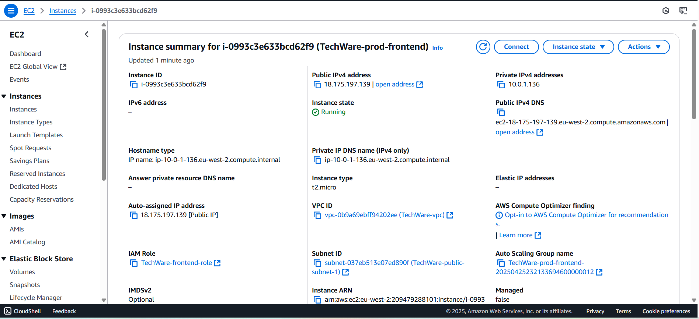
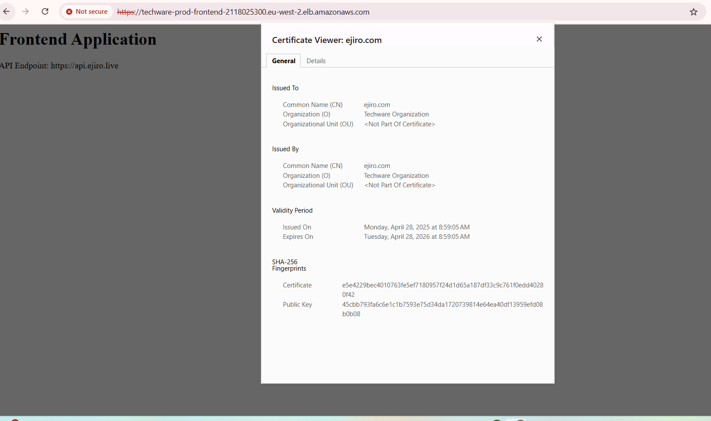
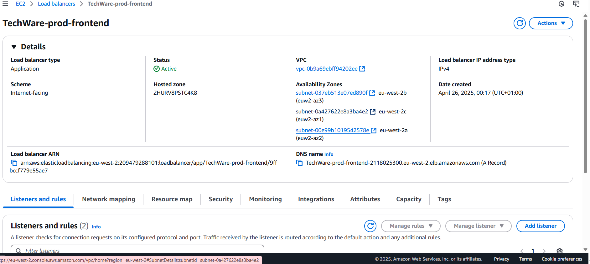
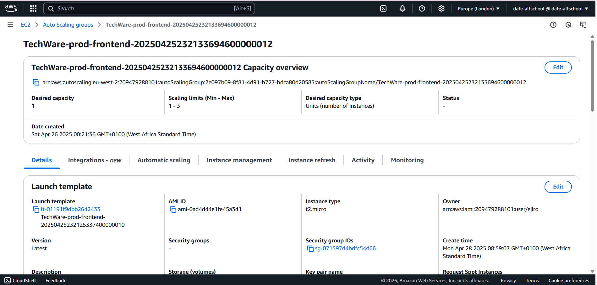
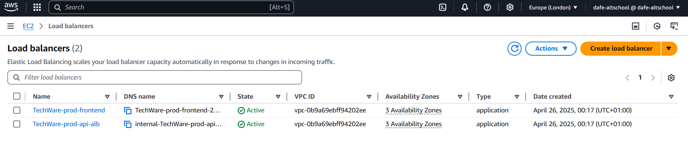
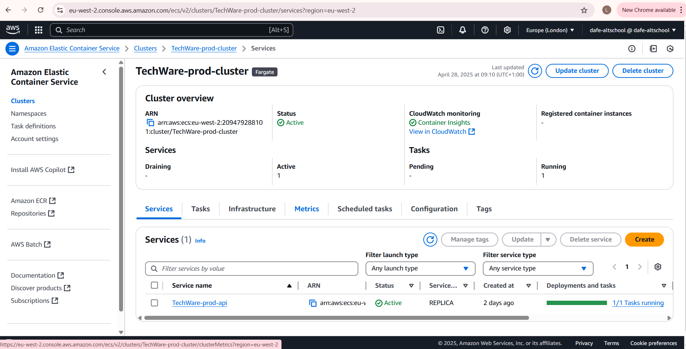
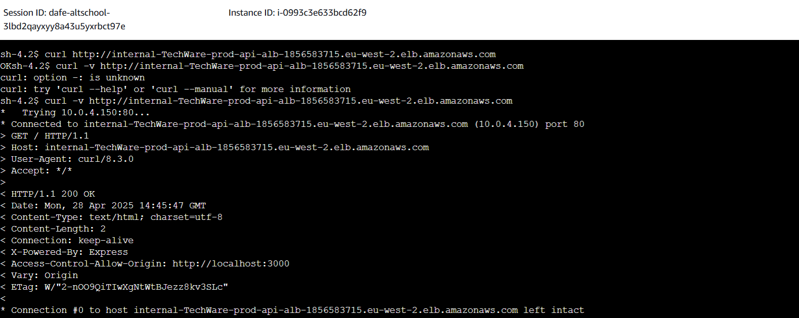
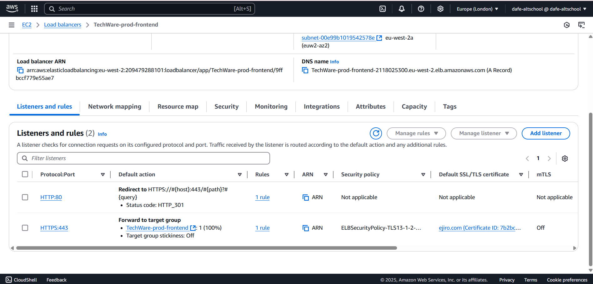
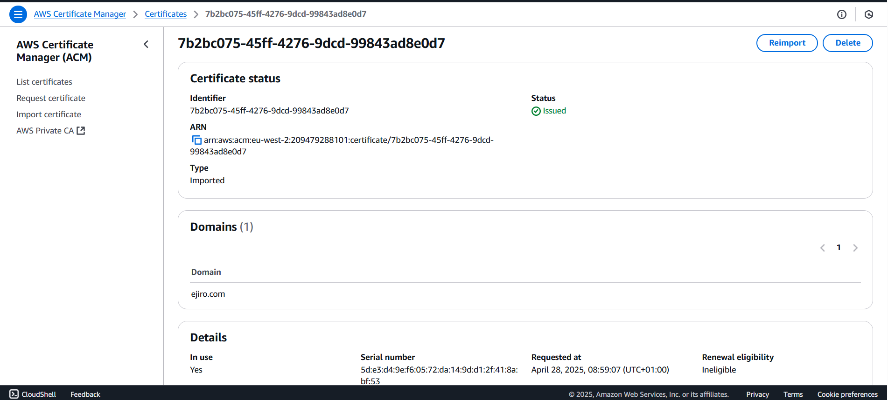
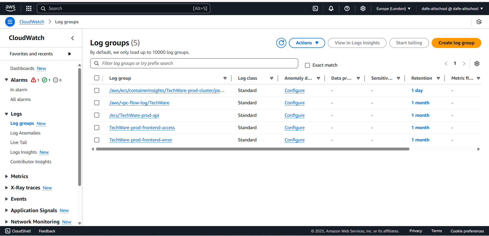


## Destroying the Infrastructure

When you're done, you can destroy the infrastructure:

```bash
terraform destroy
```

## Architecture Customization

### Scaling Configuration

You can adjust the scaling parameters in `variables.tf`:

```hcl
variable "min_size" {
  description = "Minimum size of the Auto Scaling Group"
  type        = number
  default     = 1
}

variable "max_size" {
  description = "Maximum size of the Auto Scaling Group"
  type        = number
  default     = 3
}
```

### Changing Backend Health Check Path

If you need to use a different health check path:

```hcl
variable "health_check_path" {
  description = "Path for health checks"
  type        = string
  default     = "/health"
}
```

## Troubleshooting

### Common Issues

1. **Task failing health checks**: Ensure your backend application has a working `/health` endpoint and is listening on the correct port.

2. **Unable to reach backend from frontend**: Check security group rules to ensure frontend instances can reach the backend ALB.

3. **Docker image issues**: Verify the ECR repository URI and image tag.

### Viewing Logs

```bash
# View ECS task logs
aws logs get-log-events --log-group-name /ecs/your-service-name --log-stream-name your-log-stream

# View EC2 user data logs
aws ec2 get-console-output --instance-id i-1234567890abcdef0
```

## Security Considerations

This architecture follows AWS security best practices:

1. Backend services are never exposed directly to the internet
2. All communications are encrypted
3. Least privilege security groups control traffic flow
4. Private subnets protect sensitive services
5. IAM roles use minimal required permissions

Remember to rotate credentials regularly and keep dependencies updated.